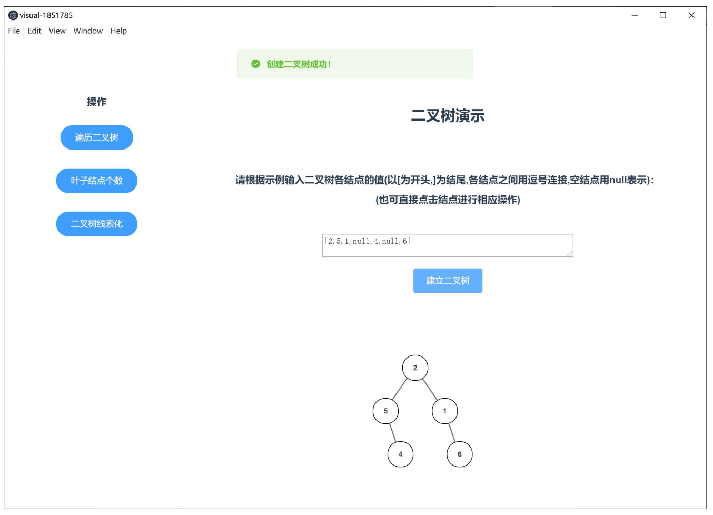
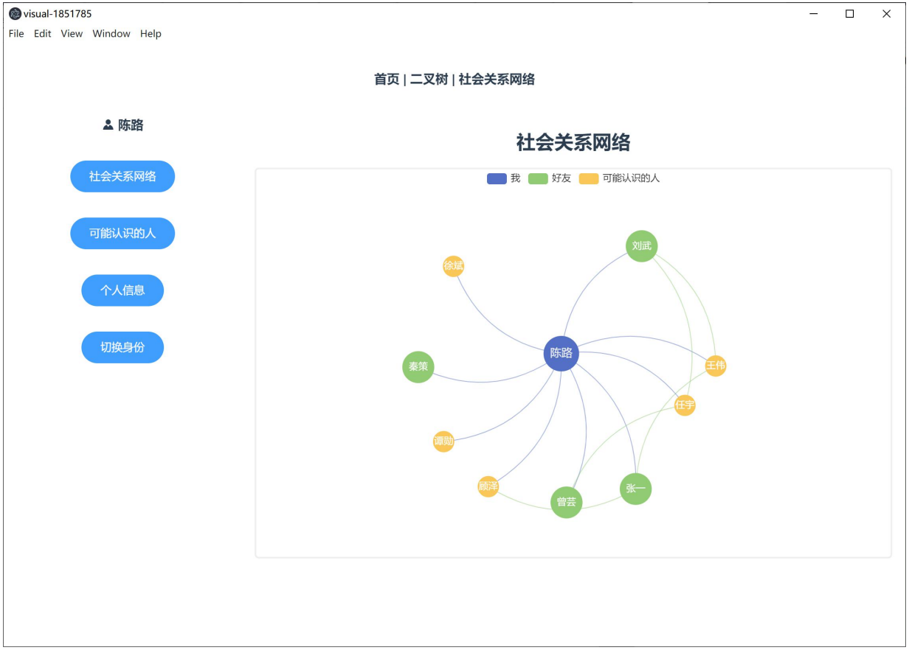

# Data Structure Visualization

This project demonstrates the visualization of various data structures including binary trees and social networks. The project is implemented using Vue.js and ECharts.

## Features

- **Binary Tree Visualization:** A graphical representation of a binary tree structure, allowing for interactive manipulation and observation.
- **Social Network Visualization:** A dynamic visualization of social network graphs, showcasing the relationships and connections between different entities.

## Installation

To run this project locally, follow these steps:

1. Clone the repository:
    ```sh
    git clone https://github.com/Jerome-Tangjl/Data-structure-visualization.git
    ```
2. Navigate to the project directory:
    ```sh
    cd Data-structure-visualization
    ```
3. Install dependencies:
    ```sh
    npm install
    ```

## Usage

### Method 1: Using Electron

In the command line within the source directory, run:
```sh
npm run electron:serve
```
You might need to download Node.js and Electron beforehand. An Electron window will automatically pop up for user interaction. Alternatively, you can also start the project by entering the given URL in a browser.

### Method 2: Using Browser

In the command line within the source directory, run:
```sh
npm run serve
```
You might need to download Node.js beforehand. Then, enter the URL shown in the command line (usually `localhost:8080`) in your browser to start the project.

## Screenshots

Below are some screenshots of the visualizations:

### Main Visualization


### Binary Tree Visualization


### Social Network Visualization

